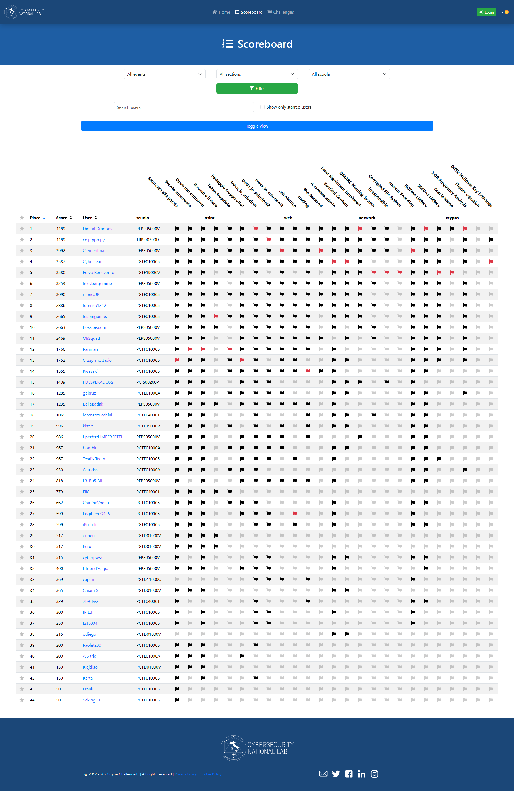

# HighSchools CTF Workshop - Perugia

Challenge per l'HighSchools CTF Workshop 2023 di Perugia

## Credits

Le challenge qua presenti sono state sviluppate dai membri dei team PGiatasti di Perugia per il quarto HighSchools CTF Workshop tenutosi all'I.T.T.S. Alessandro Volta di Perugia il 4 Dicembre 2023.

## Challenges

| Category  | Title                                    | Author                                |      Dynamic       | Type |                                             Url | Port |
| :-------- | :--------------------------------------- | :------------------------------------ | :----------------: | ---: | ----------------------------------------------: | :--: |
| crypto    | [Haxxor Encoding](crypto00)              | Nalin Dhingra <@Lotus>                |        :x:         |      |                                                 |      |
| crypto    | [ROTten L0ttery](crypto01)               | Nalin Dhingra <@Lotus>                | :heavy_check_mark: | http |       rotten-lottery.challs.cyberhighschools.it |  80  |
| crypto    | [SEEDed L0ttery](crypto02)               | Nalin Dhingra <@Lotus>                | :heavy_check_mark: | http |       seeded-lottery.challs.cyberhighschools.it |  80  |
| crypto    | [Oracle Name](crypto03)                  | Nalin Dhingra <@Lotus>                | :heavy_check_mark: | http |          oracle-name.challs.cyberhighschools.it |  80  |
| crypto    | [XOR Frequency Analysis](crypto04)       | Nalin Dhingra <@Lotus>                | :heavy_check_mark: | http |                  xor.challs.cyberhighschools.it |  80  |
| crypto    | [Flipper equation](crypto05)             | Nalin Dhingra <@Lotus>                | :heavy_check_mark: | http |     flipper-equation.challs.cyberhighschools.it |  80  |
| crypto    | [Diffie Hellman Key Exchange](crypto06)  | Nalin Dhingra <@Lotus>                | :heavy_check_mark: | http |                 dhke.challs.cyberhighschools.it |  80  |
| network   | [A careless admin](network01)            | Emanuele Bosimini <@KaiserSource>     |        :x:         |      |                                                 |      |
| network   | [Bautiful Content](network02)            | Emanuele Bosimini <@KaiserSource>     |        :x:         |      |                                                 |      |
| forensics | [Least Significant Brushwork](network03) | Emanuele Bosimini <@KaiserSource>     |        :x:         |      |                                                 |      |
| network   | [DMARC Naming System](network04)         | Emanuele Bosimini <@KaiserSource>     |        :x:         |      |                                                 |      |
| network   | [Irresponsible](network05)               | Emanuele Bosimini <@KaiserSource>     |        :x:         |      |                                                 |      |
| network   | [Corrupted File System](network06)       | Emanuele Bosimini <@KaiserSource>     |        :x:         |      |                                                 |      |
| osint     | [Sicurezza alla parata](osint01)         | Riccardo Pesciarelli <@RoboRich00A16> |        :x:         |      |                                                 |      |
| osint     | [Pronto intervento](osint02)             | Riccardo Pesciarelli <@RoboRich00A16> |        :x:         |      |                                                 |      |
| osint     | [Open top container](osint03)            | Riccardo Pesciarelli <@RoboRich00A16> |        :x:         |      |                                                 |      |
| osint     | [Il rosso e il nero](osint04)            | Riccardo Pesciarelli <@RoboRich00A16> |        :x:         |      |                                                 |      |
| osint     | [Token trapelato](osint05)               | Riccardo Pesciarelli <@RoboRich00A16> |        :x:         |      |                                                 |      |
| osint     | [Pedaggio troppo alto!](osint06)         | Riccardo Pesciarelli <@RoboRich00A16> |        :x:         |      |                                                 |      |
| web       | [trova_le_soluzioni](web01)              | Federico Sabbatini <@FedericoHeichou> | :heavy_check_mark: | http |   trova-le-soluzioni.challs.cyberhighschools.it |  80  |
| web       | [trova_le_soluzioni2](web02)             | Federico Sabbatini <@FedericoHeichou> | :heavy_check_mark: | http | trova-le-soluzioni-2.challs.cyberhighschools.it |  80  |
| web       | [trova_le_soluzioni3](web03)             | Federico Sabbatini <@FedericoHeichou> | :heavy_check_mark: | http | trova-le-soluzioni-3.challs.cyberhighschools.it |  80  |
| web       | [calcolatrice](web04)                    | Federico Sabbatini <@FedericoHeichou> | :heavy_check_mark: | http |         calcolatrice.challs.cyberhighschools.it |  80  |
| web       | [trading](web05)                         | Federico Sabbatini <@FedericoHeichou> | :heavy_check_mark: | http |              trading.challs.cyberhighschools.it |  80  |
| web       | [the_backend](web06)                     | Federico Sabbatini <@FedericoHeichou> | :heavy_check_mark: | http |          the-backend.challs.cyberhighschools.it |  80  |

## Scoreboard

