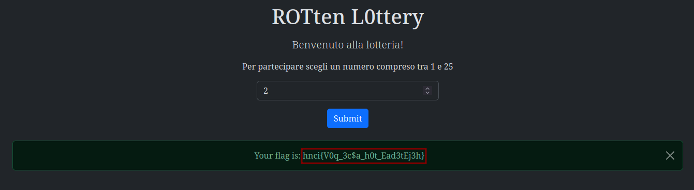
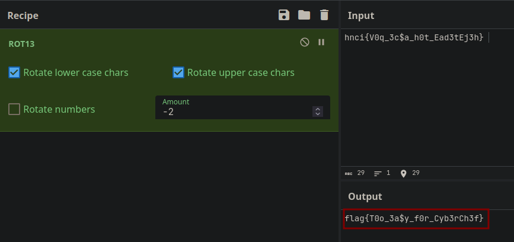

# 4th HighSchools CTF Workshop - Perugia 2023

## [crypto] ROTten L0ttery - Writeup

### Descrizione

Per ottenere la flag dobbiamo fornire un numero compreso fra 1 e 25, che verrà utilizzato per ruotare il testo della flag di un numero di posizioni pari al numero fornito.

### Soluzione

La flag effettiva può essere ottenuta effettuando la rotazione inversa.
La seguente "ricetta" in cyberchef ci permette di ottenere la flag:
`https://cyberchef.org/#recipe=ROT13(true,true,false,-2)&input=aG5jaXtWMHFfM2MkYV9oMHRfRWFkM3RFajNofSA`

