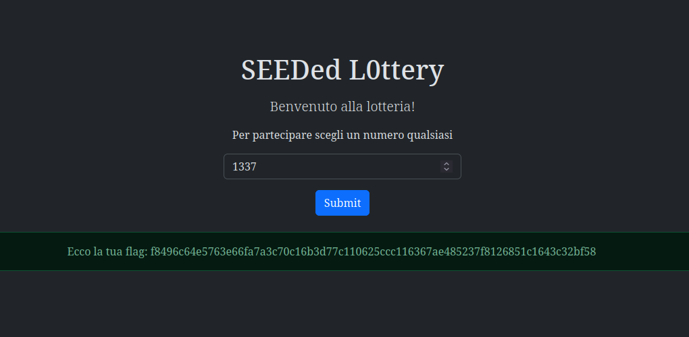
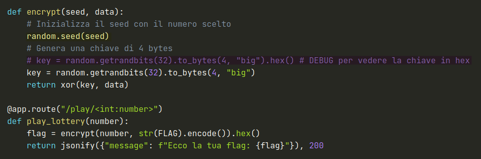
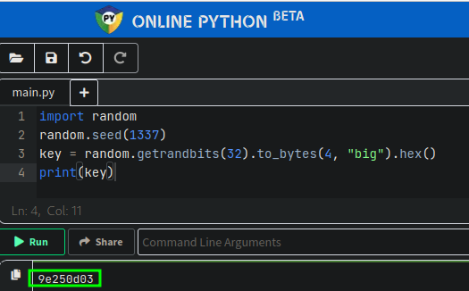
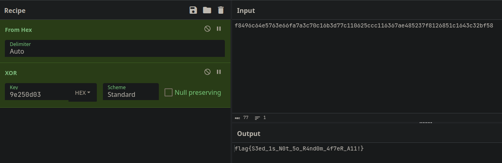

# 4th HighSchools CTF Workshop - Perugia 2023

## [crypto] SEEDed L0ttery - Writeup

La challenge ci presenta un interfaccia in cui possiamo inserire un numero, e una volta fatto ciò si riceve la flag cifrata ed encodata in hex.

Inoltre sempre dal sito della challenge è possibile leggere il codice sorgente del programma, che fornisce i dettagli necessari a decifrare la flag, e un piccolo hint su come fare.

### Soluzione

Per decifrare la flag quindi è necessario recuperare la chiave utilizzata per effettuare lo xor.
Dato che il seed viene fornito dall'utente, si può recuperare la chiave utilizzando la stessa funzione che viene utilizzata per generarla.
Per facilità si può anche utilizzare un interprete python online.

Una volta recuperata la chiave è possibile decifrare la flag facendo lo xor tra la chiave e la flag encodata in hex.

