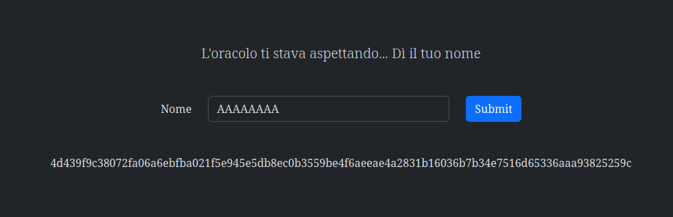

# 4th HighSchools CTF Workshop - Perugia 2023

## [crypto] Oracle Name - Writeup

La challenge fornisce un form in cui si può inserire del testo, una volta che il testo viene inviato si riceve una stringa in hex che conterrà la flag cifrata.

### Analisi del codice

Osservando il codice sorgente della pagina si può notare che il testo che inviamo viene preposto alla flag e poi cifrato tramite XOR con una chiave randomica di 8 bytes.
Questo fatto ci permette di ottenere la flag tramite un attacco di tipo known-plaintext.

### Soluzione

Se forniamo un testo di 8 bytes (ad esempio 8 volte la lettera "A") otterremo la flag cifrata, che chiameremo `ciphertext`.
I primi 8 caratteri del ciphertext possono essere decifrati effettuando uno XOR con il testo che abbiamo inviato, ottenendo così i bytes della chiave randomica.
Una volta ottenuti i primi 8 bytes della chiave possiamo decifrare il resto del ciphertext e ottenerne la flag.

### Risoluzione con Cyberchef

Queste operazioni possono essere effettuate con Cyberchef come segue:

1. Effettuiamo lo XOR fra i primi 8 bytes del ciphertext e il testo che abbiamo inviato, ottenendo così i bytes della chiave.
   Per comodità nel copiare i dati possiamo usare le funzioni `From Hex` e `To Hex` di Cyberchef.
   
2. Decifriamo il resto del ciphertext usando la chiave trovata al passo precedente.
   
