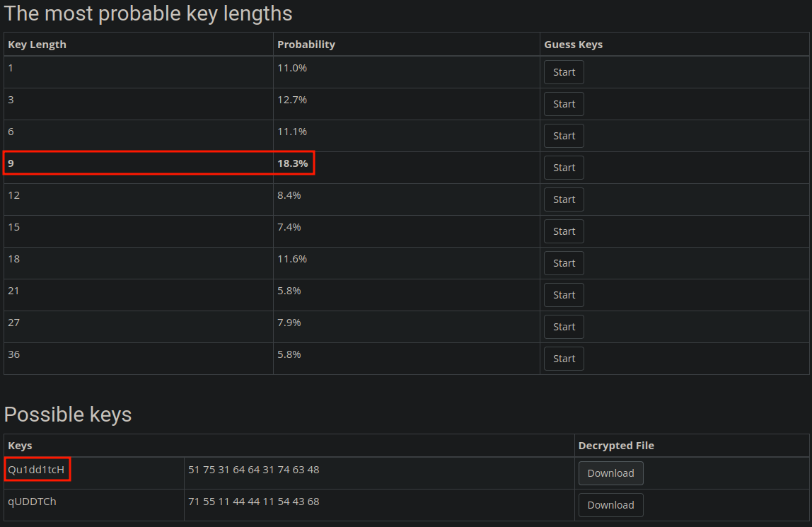

# 4th HighSchools CTF Workshop - Perugia 2023

## [crypto] XOR Frequency Analysis - Writeup

Per risolvere questa challenge bisogna effettuare un'analisi delle frequenze di un testo cifrato con XOR e una chiave che viene ripetuta.

Questa analisi può essere effettuata in diversi modi, ma dato che si può supporre dalla descrizione della challenge che il testo cifrato sia in inglese, la soluzione più conveniente è usare un tool online.

### Risoluzione con XOR Cracker

Effettuando una ricerca su Google con le parole chiave "xor frequency analysis" si trova subito [tool](https://wiremask.eu/tools/xor-cracker/) che permette di risolvere la challenge.

La challenge fornisce il testo cifrato sia come testo visualizzato sulla pagina in formato hex sia come file scaricabile.
Si può quindi scaricare il file e caricarlo sul tool per ottenere il testo in chiaro e la chiave di XOR utilizzata.

Una volta ottenuto il testo in chiaro si può leggere la flag in fondo ad esso.
