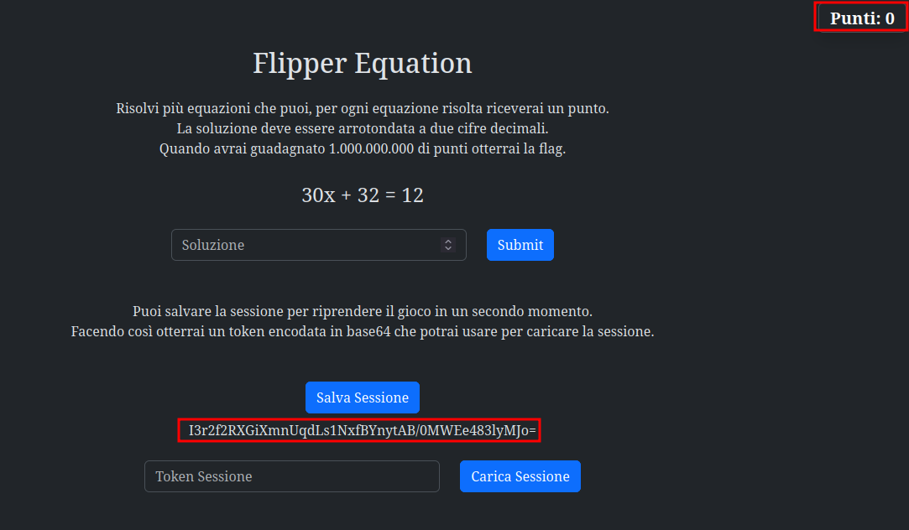
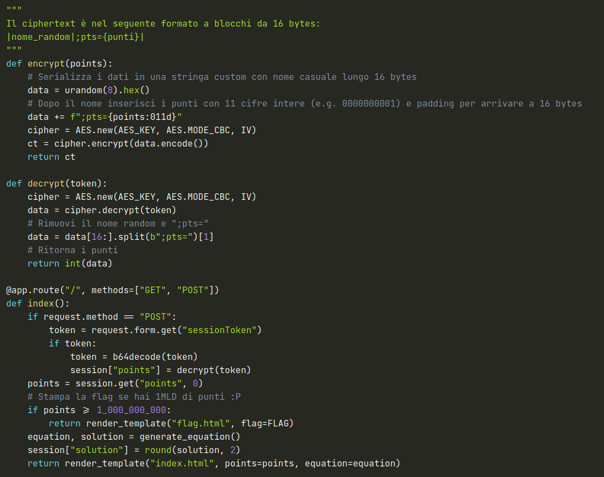
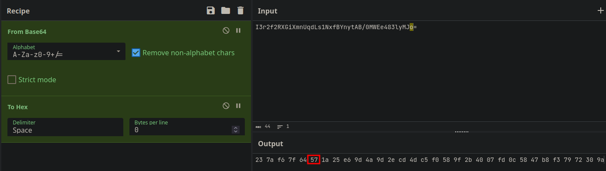
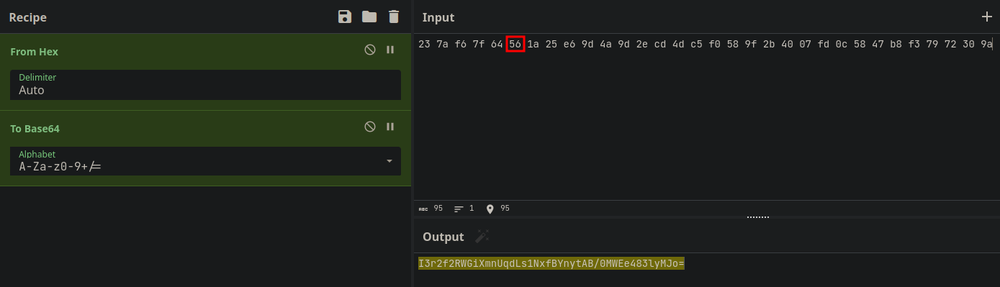
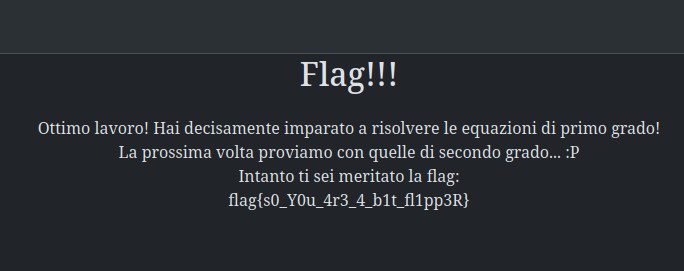

# 4th HighSchools CTF Workshop - Perugia 2023

## [crypto] Flipper equation - Writeup

La challenge mostra una sorta di gioco in cui vengono presentate delle equazioni di primo grado e l'utente deve fornire la soluzione ad esse.

Per ogni soluzione corretta viene guadagnato 1 punto, ma per ottenere la flag sono richiesti 1 miliardo di punti.

Dato l'elevato numero di punti richiesti, è evidente che non è possibile risolvere tutte le equazioni necessarie ad ottenere la flag.

La sfida però presenta un ulteriore funzionalità, che permette di "salvare" la partita corrente e riprenderla in un secondo momento.

Questo salvataggio viene effettuato dando all'utente un token che è cifrato con AES CBC e una chiave segreta generata in maniera crittograficamente sicura e codificato in base64.

## Vulnerabilità

Analizzando il codice sorgente si può capire (grazie anche all'aiuto fornito dai commenti) come viene generato il token.

Si può notare che in testo cifrato è formato da 2 blocchi, il primo ignorato che contiene caratteri casuali e il secondo che contiene la stringa `;pts=` e il numero di punti guadagnati finora rappresentati con 11 cifre intere.
Si può quindi effettuare un Bit Flipping Attack per modificare il numero di punti guadagnati ed ottenere così la flag.

### Soluzione

La challenge può essere risolta con cyberchef nel seguente modo:

1. Otteniamo il testo cifrato con codifica esadecimale per poterlo manipolare facilmente.
   
2. Una volta fatto ciò, possiamo notare che il valore del numero di punti è preceduto nel suo blocco dalla stringa ";pts=" lunga 5 caratteri.
   Pertanto modificando un bit qualunque nel sesto byte del primo blocco, andremo a modificare nel momento della decifratura la cifra più significativa del numero di punti, ottenendo così un valore di sicuro superiore al miliardo.
   
3. È quindi possibile ricodificare il nuovo ciphertext in base64 e usarlo per caricare la partita salvata, questo ci permetterà di ottenere i punti necessari a ricevere la flag.
   
