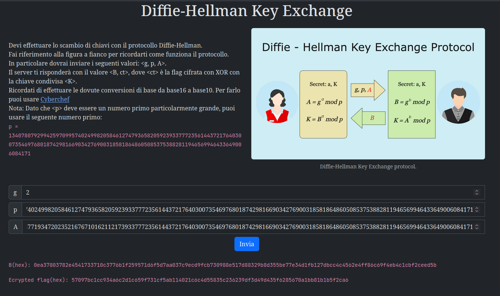

# 4th HighSchools CTF Workshop - Perugia 2023

## [crypto] Diffie-Hellman Key Exchange - Writeup

Per risolvere questa challenge bisogna effettuare correttamente uno scambio di chiavi Diffie-Hellman per poi decifrare la flag con la chiave ottenuta.

La challenge ci suggerisce già un numero primo `p` da utilizzare come modulo.

### Soluzione

Si può utlizzare il valore di p fornito in congiunzione con dei valori validi per `g` e `a` per ottenere la chiave pubblica `A`.
L'operazione di esponeziazione modulare può essere effettuata con python o per maggiore facilità con dcode.fr.

Una volta ottentuta la chiave pubblica `A` possiamo inviare i valori al server per ottenere la chiave pubblica `B` e la flag cifrata.

#### Cambio di base

Entrambi i valori vengono forniti in esadecimale che a seconda di come vengono effettuate le operazioni può essere fastidioso da gestire.
Per tale motivo nella challenge viene consigliato di utilizzare Cyberchef per effettuare le dovute conversioni di base.

Una volta che si ha il valore di B possiamo calcolare la chiave condivisa K sempre con l'ausilio di dcode.fr.

#### Decifratura della flag

A questo punto si può decifrare la flag con la chiave ottenuta, sempre tenendo conto della conversione di base e della trasformazione da hex a bytes.

